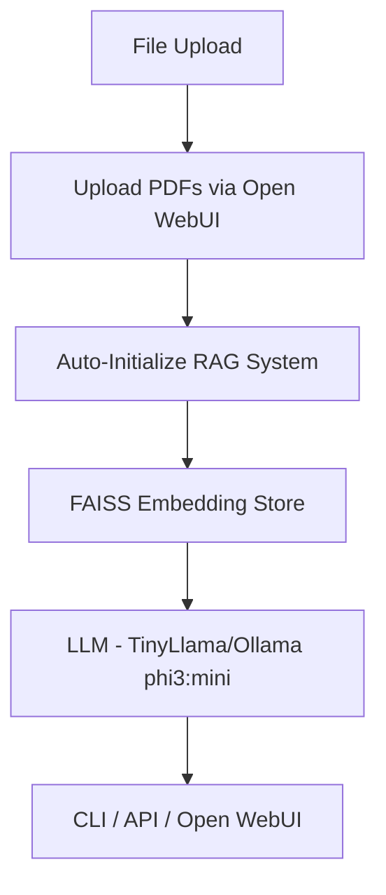

# 🧠 RAG PDF Chatbot with CLI & GUI


> A **Retrieval-Augmented Generation (RAG)** chatbot that lets you query local PDF documents using natural language — via CLI or GUI with **seamless file upload integration**.

---

## 🚀 Features

- 📄 **Upload and chat with PDF documents** directly through Open WebUI
- 🗂 Uses **FAISS** for local vector storage with intelligent caching
- 🤖 **TinyLlama** and **Ollama phi3:mini** for local LLM inference
- ⚙️ Supports **CPU/GPU** with automatic detection
- ⚡ **Auto-initialization** - no manual API calls needed
- 🔄 **Smart caching** - reuses embeddings for faster performance
- 🌐 **OpenAI API compatible** - works seamlessly with Open WebUI

---

## ⚡ Quick Start (Diagram)



---

## 🧪 CLI Usage

### 1️⃣ Activate Virtual Environment
```bash
# Windows
source venv/Scripts/activate

# macOS / Linux
source venv/bin/activate
```

### 2️⃣ Query via CLI
```bash
python CLI_app.py --pdfs sample_pdfs/sample1.pdf --use_gpu --show_chunks
```

---

## 🌐 Open WebUI Integration (Recommended)

### ✨ **NEW: Simplified Workflow**
No more manual API calls! Upload PDFs directly through Open WebUI and start chatting immediately.

### 🚀 Quick Setup

#### 1️⃣ Start the API Server
```bash
uvicorn api_server:app --host 0.0.0.0 --port 8000
```

#### 2️⃣ Start Open WebUI
```bash
docker run -d \
  -p 3000:8080 \
  -e OPENAI_API_BASE_URL=http://YOUR_IP:8000/v1 \
  -e OPENAI_API_KEY=dummy-key \
  -v open-webui:/app/backend/data \
  --name open-webui \
  ghcr.io/open-webui/open-webui:main
```

#### 3️⃣ Access and Use
1. **Open**: `http://YOUR_IP:3000` (replace YOUR_IP with your machine's IP, e.g., `10.20.41.185:3000`)
2. **Select Model**: Choose `TinyLlama/TinyLlama-1.1B-Chat-v1.0` or `phi3:mini`
3. **Upload PDFs**: Click the 📎 attachment icon and upload your PDF files
4. **Start Chatting**: Ask questions immediately - the system auto-initializes!

---

## 📌 Connection Settings

### 🌍 **Network Access** (All Systems)
- **API URL**: `http://YOUR_MACHINE_IP:8000/v1` (e.g., `http://10.20.41.185:8000/v1`)
- **API Key**: Any dummy value (e.g., `dummy-key`)

### 🏠 **Local Access Only**
- **API URL**: `http://localhost:8000/v1` or `http://127.0.0.1:8000/v1`
- **API Key**: Any dummy value

### 🐳 **Docker Users**
- **API URL**: `http://host.docker.internal:8000/v1`
- **API Key**: Any dummy value

---

## 🔧 Model Setup

### 🤖 **TinyLlama (Default)**
- **Model ID**: `TinyLlama/TinyLlama-1.1B-Chat-v1.0`
- **Backend**: Hugging Face Transformers
- **GPU Support**: Automatic detection
- **Setup**: No additional setup required

### 🦙 **Ollama phi3:mini**
- **Model ID**: `phi3:mini`
- **Backend**: Ollama
- **Prerequisites**: Ollama must be installed and running

#### Ollama Setup:
```bash
# Install model
ollama create phi3:mini -f Modelfile

# Restart Ollama service
ollama stop
ollama serve

# Verify model is available
ollama list
```

---

## 💡 **NEW: Auto-Initialization Features**

### 🔄 **Smart Workflow**
1. **Upload PDFs** through Open WebUI's file upload interface
2. **Select your preferred model** from the dropdown
3. **Ask questions** - the system automatically:
   - Detects uploaded PDFs
   - Initializes the selected model
   - Creates/loads vector embeddings
   - Starts answering your questions

### 📁 **File Management**
- Uploaded files are stored in `uploaded_pdfs/` directory
- Vector embeddings cached in `vector_cache/` for faster reloads
- Support for multiple PDFs simultaneously

### 🧠 **Intelligent Model Detection**
- **HuggingFace models**: Automatic GPU detection and usage
- **Ollama models**: Automatic local inference setup
- **Fallback handling**: Graceful error recovery

---

## 🛠️ Advanced Usage

### 📊 **Status Monitoring**
Check system status and uploaded files:
```bash
curl http://localhost:8000/status
```

### 🗑️ **Clear Uploads**
Reset the system and clear uploaded files:
```bash
curl -X POST http://localhost:8000/clear_uploads
```

### 📋 **List Files**
View all uploaded files:
```bash
curl http://localhost:8000/v1/files
```

---

## 🔧 Installation & Dependencies

### 1️⃣ **Install Python Dependencies**
```bash
pip install -r requirements.txt
```

### 2️⃣ **Install NLTK Data** (Required for text processing)
```bash
python -c "import nltk; nltk.download('punkt_tab'); nltk.download('punkt'); nltk.download('stopwords')"
```

### 3️⃣ **GPU Support** (Optional)
For CUDA GPU acceleration:
```bash
pip install torch torchvision torchaudio --index-url https://download.pytorch.org/whl/cu118
```

---

## 🚀 API Endpoints

### **Core Endpoints**
- `GET /v1/models` - List available models
- `POST /v1/chat/completions` - OpenAI-compatible chat
- `POST /v1/files` - Upload PDF files
- `GET /v1/files` - List uploaded files

### **Management Endpoints**
- `GET /status` - System status and file count
- `POST /clear_uploads` - Clear all uploaded files
- `POST /unload_model` - Free memory
- `POST /load_pdfs` - Manual PDF loading (legacy)

---

## 🔍 Troubleshooting

### **Common Issues:**

#### NLTK Data Missing
```bash
# Error: Resource punkt_tab not found
python -c "import nltk; nltk.download('punkt_tab')"
```

#### Network Access Issues
- Ensure API server runs with `--host 0.0.0.0`
- Check firewall settings for ports 8000 and 3000
- Use actual IP address instead of localhost for remote access

#### Model Loading Errors
- Check GPU availability: `python -c "import torch; print(torch.cuda.is_available())"`
- Ensure sufficient disk space for model downloads
- Verify Ollama is running for phi3:mini model

---

## 🌟 What's New in v2.0

### ✨ **Major Updates:**
- **🎯 Zero-Configuration Setup**: Upload files and start chatting instantly
- **📁 Seamless File Upload**: Direct PDF upload through Open WebUI interface
- **🔄 Auto-Initialization**: Automatic RAG system setup with uploaded files
- **🌐 Network-Ready**: Easy multi-system access with proper IP configuration
- **🧠 Smart Model Detection**: Automatic backend selection based on model choice
- **📊 Enhanced Monitoring**: Better status reporting and file management

### 🔧 **Technical Improvements:**
- OpenAI Files API compatibility (`/v1/files`)
- Automatic NLTK data download
- Improved error handling and user feedback
- Better caching and performance optimization

---

## 📜 License
This project is licensed under the **MIT License**.

---

## 🤝 Contributing
1. Fork the repository
2. Create a feature branch
3. Commit your changes
4. Push to the branch
5. Create a Pull Request

---

## 💡 Tips for Best Performance

- **Use SSD storage** for faster embedding cache access
- **Enable GPU** for faster model inference (HuggingFace models)
- **Upload PDFs once** - embeddings are cached for reuse
- **Use smaller PDFs** for faster initial processing
- **Monitor memory usage** with multiple large documents